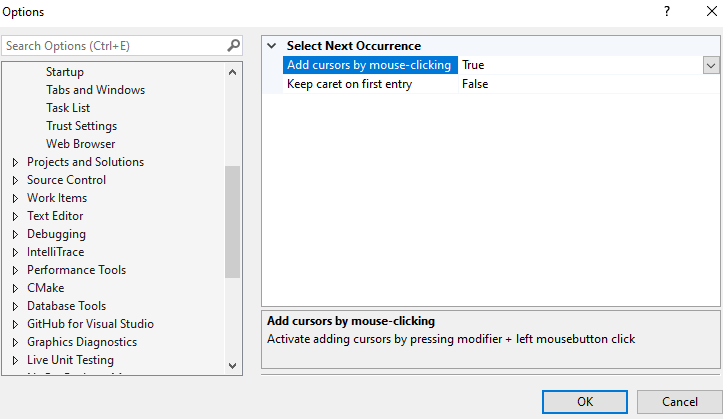
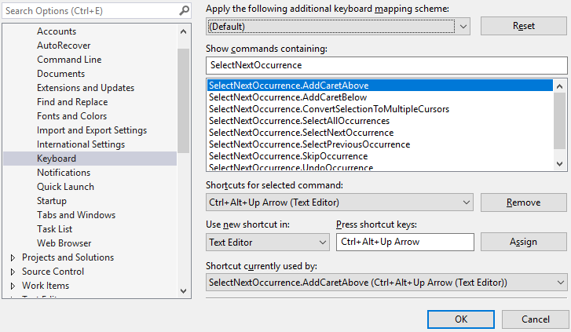

[](https://ci.appveyor.com/project/2mas/selectnextoccurrence)
# Select Next Occurrence

Download this extension from the [VS Gallery](https://marketplace.visualstudio.com/items?itemName=thomaswelen.SelectNextOccurrence) or get the latest [CI-build](http://vsixgallery.com/extension/NextOccurrence.b213c4e9-b96f-4f9d-b1d6-fa8bc7e9da21/).

---------------------------------------

This extension makes it possible to select multiple occurrences of a selected text for simultaneous editing with multiple cursors. Provides the most common multi-editing features.

Aims to replicate the multi-editing features of Sublime Text/Visual Studio Code for faster coding.

See the [change log/roadmap](CHANGELOG.md) for changes and Roadmap.


### What differs this from the built-in multi-edit of VS 2019/2022?
| Feature | Select Next Occurrence | Visual Studio |
| --- | --- | ---|
| Multiple cursors | Yes | Yes |
| Can undo cursor | Yes | Yes |
| Can select all occurrences | Yes | Yes |
| Can skip occurrence | Yes | Yes |
| Can select backwards/up | Yes | No |
| Can add caret above/below | Yes | No |
| Can add caret by mouse | Yes | No |
| Can convert selection to carets | Yes | No |
| Can search both case insensitive and exact | Yes | No, only exact |
| Multi copy/paste across files and to external programs | Yes | No |
| Supports VS 2022 | Yes | Yes |
| Supports VS 2019 | Yes | Yes |
| Supports VS 2017 | Yes | From v15.8 |
| Multi-cursor IntelliSense | No | No |


## Features

- Select next occurrence of current selection
- Select next exact occurrence (overrides Find-dialog)
- Select previous occurrence
- Select previous exact occurrence (overrides Find-dialog)
- Select all occurrences
- Convert a selection into multiple cursors
- Skip occurrence
- Undo occurrence
- Add caret above/below
- Use multiple carets to edit
- Add carets by mouse-clicking, press ALT and click to add a new caret or to remove caret/selection at clicked position
- Copy/paste multiple selections, also to external programs


---------------------------------------

### Options
- Toggle case-sensitive search by using the "Match case" setting from the find-dialog (Ctrl+F)

- Toggle match-whole word search by using the "Match whole word" setting from the find-dialog (Ctrl+F)

- Options-dialog: Add cursors by mouse-clicking - true by default

- Options-dialog: Keep caret on first entry - false by default, activates behaviour to keep caret on first entry when pressing escape



---------------------------------------

### Key-bindings
Go to Tools -> Options -> Environment -> Keyboard and search for these command names to edit at your choice. Make sure the _Use new shortcut in_ is set to: ***Text Editor***

| Command (prefix ```SelectNextOccurrence.```) | Recommendation |
| :--- | :--- |
| ```SelectNextOccurrence``` | Ctrl+D |
| ```SelectNextExactOccurrence``` | |
| ```SelectPreviousOccurrence``` | Ctrl+E |
| ```SelectPreviousExactOccurrence``` | |
| ```SelectAllOccurrences``` | Ctrl+K, Ctrl+A |
| ```SkipOccurrence``` | Ctrl+K, Ctrl+D |
| ```UndoOccurrence``` | Ctrl+U |
| ```AddCaretAbove``` | Ctrl+Alt+Up |
| ```AddCaretBelow``` | Ctrl+Alt+Down |
| ```ConvertSelectionToMultipleCursors``` | Ctrl+Shift+I or Alt+Shift+I (vscode)) |



---------------------------------------

### Troubleshooting

- **Nothing happens when pressing assigned keys**

Check that the key-bindings are correct and that the _Use new shortcut in_ is set to: ***Text Editor***.

- **Nothing happens when ALT + left-clicking mouse button to add new caret, multiple edits are unresponsive**

There is a possibility that other plugins use this functionality too, and a conflict occurs. Please check for other installed plugins with this feature and try to disable.

- **Copy/cut multiple occurrences doesnt work as expected**

There is a conflict with the extension Copy As Html, if you have this enabled, try to disable it and see if this helps.

---------------------------------------

### Contribute
Check out the [contribution guidelines](CONTRIBUTING.md)
if you want to contribute to this project.

### License
[Apache 2.0](LICENSE)
